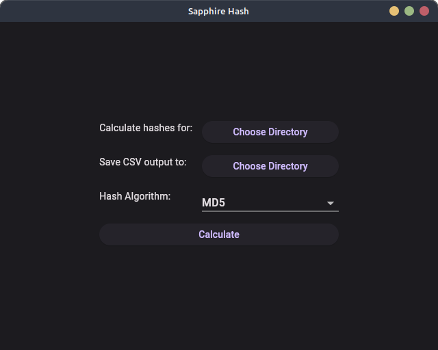

<div align="center">
  <div></div>
  <h1>Sapphire Hash</h1>
  <p>
    A recursive, performant hash calculator written in Rust!
  </p>
</div>

| Command-line Tool                                                             | Graphical User Interface                          |
| ----------------------------------------------------------------------------- | ------------------------------------------------- |
|  |  |

## Usage (GUI)

Download the app from the [releases page](https://github.com/rhian-cs/sapphire-hash/releases), extract it an run it.

## Usage (CLI)

Install Rust and Cargo: https://rustup.rs/

Install the app with:

```sh
cargo install sapphire-hash
```

Run with:

```sh
sapphire-hash --algorithm <ALGORITHM> <DIRECTORY>
```

Where:

- `DIRECTORY` can be either the relative or the full path to the desired directory or file.
- `ALGORITHM` is the desired hash algorithm. Only algorithms implemented by OpenSSL are available:
  - `md5`
  - `sha1`
  - `sha224`
  - `sha256`
  - `sha384`
  - `sha512`
  - `sha3_224`
  - `sha3_256`
  - `sha3_384`
  - `sha3_512`
  - `shake128`
  - `shake256`
  - `ripemd160`
  - `sm3`

Optionally, you can add an `--output <OUTPUT_PATH>` to specify the output. End the file in `.csv` to generate a CSV report.

### Logging

You may also enable logging by using the `RUST_LOG=trace` environment variable.

If you want to pipe the results and log results to separate files, you may use:

```sh
RUST_LOG=trace recursive-hash-calculator-cli --algorithm ALGORITHM DIRECTORY | tee result.txt 2>/dev/stdout | tee log.txt
```

## Development

### Dependencies

- Rust (https://rustup.rs/)
- Build Tools (For Ubuntu install the `build-essential` package)
- OpenSSL (For Ubuntu install the `libssl-dev` package)
- Flutter and other native dependencies for GUI development (see [flutter_gui/README.md](flutter_gui/README.md))

### Setup

Clone the repository.

Run `cargo build`.

Use the app like so:

```sh
./target/debug/recursive-hash-calculator-cli --algorithm ALGORITHM DIRECTORY
```

### Building for Production

Run:

```sh
OPENSSL_STATIC=true cargo build --release
```

Use the app like so:

```sh
./target/release/recursive-hash-calculator-cli --algorithm ALGORITHM DIRECTORY
```

### Running Automated Tests

Run:

```sh
cargo test
```

### Creating Files for Manual Testing

Use the script for creating random files: `scripts/generate_example_files.sh`

Check the script code for available options.

### Linting

Run:

```sh
RUSTFLAGS=-Dwarnings cargo clippy --all-targets --all-features
```

### GUI Development

Whenever you update the `flutter_bridge` project, be sure to run the codegen so that the Flutter project picks up the changes. Inside `gui_flutter`, run:

```sh
flutter_rust_bridge_codegen generate
```

See more about GUI development in [flutter_gui/README.md](flutter_gui/README.md)

<!--
### Publish Crate
```sh
cargo publish -p sapphire-hash-core --dry-run
cargo publish -p sapphire-hash --dry-run
```
-->
